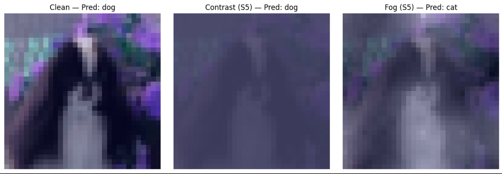

<h1 align="center">Failure Modes of Vision Models</h1>

When CNNs Fail: Robustness Under Distribution Shift

---

> Second-year AI undergraduate exploring robustness and reliability in deep learning systems.

---

## 1. Research Question

**Do convolutional neural networks degrade gracefully under distribution shift, or do structured corruptions induce predictable failure modes?**

Modern vision models achieve high accuracy on curated benchmarks, yet real-world environments introduce blur, noise, compression artifacts, and environmental distortions.

This project investigates not only *whether models fail*, but *how failure unfolds.*

---

## 2. Problem

High benchmark accuracy does **not** guarantee real-world reliability.

Models optimized for clean datasets often exhibit brittle behavior when exposed to distribution shifts. Understanding these failures is essential for building dependable AI systems.

---

## 3. Why It Matters

Real-world deployment rarely resembles benchmark conditions.

Autonomous systems, medical imaging pipelines, and safety-critical perception models must operate under imperfect sensing conditions. Robustness is not secondary — it is foundational.

This raises a central question:

> Do modern CNNs fail gradually, or collapse under specific perturbations?

---

## 4. Method

### Models
- ResNet18  
- DenseNet121  

### Training
- Dataset: CIFAR-10  
- Standard augmentation pipeline  
- Cross-entropy optimization  

### Robustness Evaluation
- Dataset: CIFAR-10-C  
- Severity levels: 1–5  
- Accuracy and performance drop analysis  

### Corruptions Studied
- Contrast  
- Fog  
- Motion Blur  
- Gaussian Noise  
- JPEG Compression  
- Brightness  

Rather than reporting a single robustness score, this study examines **behavioral degradation patterns** across severity levels.

---

## 5. Key Findings

- Up to **43% accuracy drop** under severe contrast  
- Robustness is corruption-dependent, not uniform  
- Structural corruptions caused greater degradation than pixel-level perturbations  
- JPEG compression and brightness showed comparatively graceful degradation  
- DenseNet121 demonstrated slightly stronger resilience  

These results indicate that distribution shift induces **distinct failure regimes**, not merely performance decay.

---

## 6. Robustness Degradation Curves

Severity-based evaluation reveals different collapse dynamics:

- **Contrast → near-linear degradation**
- **Fog → threshold-driven collapse**
- **Motion Blur → early feature damage followed by stabilization**

  

---

## 7. Interpretability: Why Do Models Fail?

Grad-CAM was used to examine model attention under corruption.

### Observed Behavior
- Clean inputs produce object-centric activation  
- Severe corruptions cause attention drift toward background regions  
- Feature localization weakens  

This suggests robustness failures stem from **feature collapse**, not random misclassification.

  

---

## 8. Architecture Insight

While DenseNet121 showed marginally better robustness, both architectures remained vulnerable to structural distortions.

Improved connectivity does not necessarily translate to distributional resilience.

Robustness remains an open challenge in deep vision systems.

---

## 9. Limitations

- CIFAR-10 is low resolution (32×32)  
- Only CNN architectures evaluated  
- Corruptions are synthetic  
- No robustness training applied  

Recognizing these constraints prevents overgeneralization.

---

## 10. Future Directions

- Vision Transformer robustness comparison  
- Robust training strategies (AugMix, DeepAugment)  
- Higher-resolution datasets  
- Failure prediction and uncertainty metrics  

---

## 11. Repository Structure
<<<<<<< Updated upstream

notebooks/
01_train_resnet18.ipynb
02_train_densenet121.ipynb
03_cifar10c_evaluation.ipynb
04_severity_curves.ipynb
05_gradcam_analysis.ipynb

=======
notebooks/
01_train_resnet18.ipynb
02_train_densenet121.ipynb
03_cifar10c_evaluation.ipynb
04_severity_curves.ipynb
05_gradcam_analysis.ipynb

>>>>>>> Stashed changes
figures/
models/
notes/

---

## 12. Takeaway

Robustness is not binary.

Convolutional networks exhibit structured, corruption-specific degradation patterns that can be systematically analyzed.

Understanding these failure modes is essential for building reliable AI systems in real-world environments.
<<<<<<< Updated upstream
=======

>>>>>>> Stashed changes
